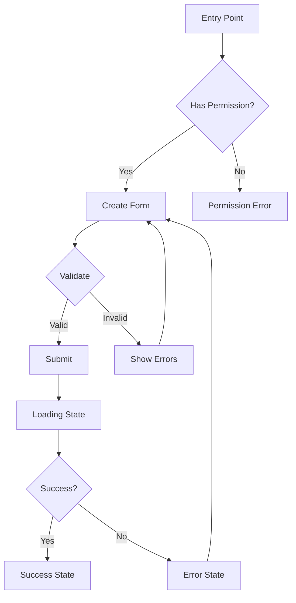
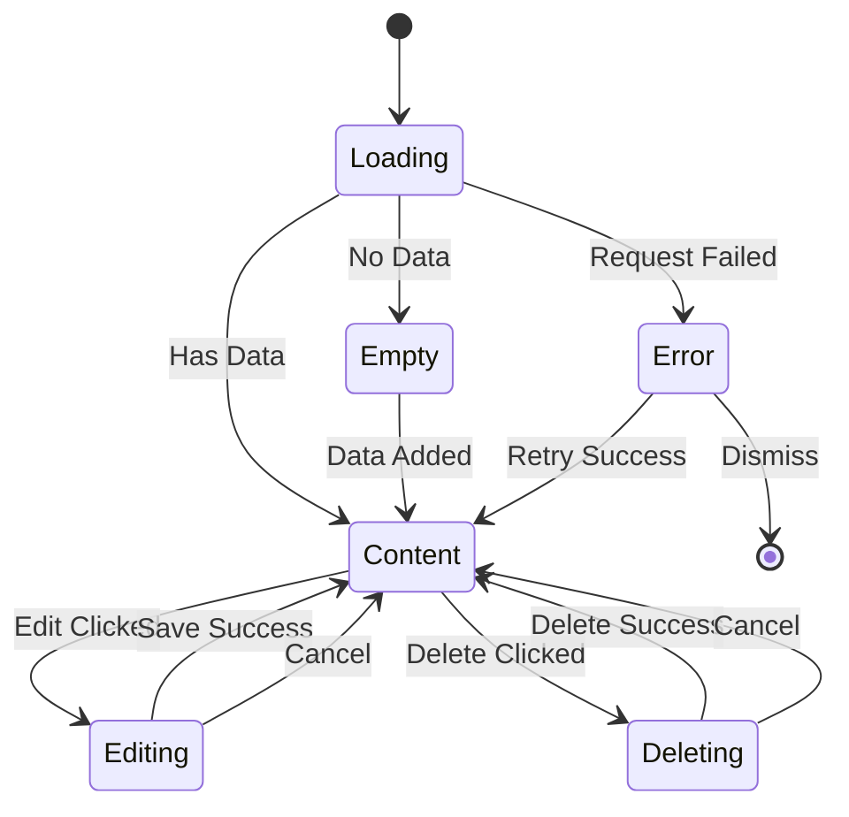

# IA Designer Agent (AI-Enhanced)

## Mission
Design information architecture, user flows, keyboard flows, and wireframes using Manus JTBD and Midjourney/Canva visuals. Focus on emotion → narrative → behavior, not screens.

## When to Use

- **After PRD**: When you have a PRD and need to design IA and flows
- **Before Build**: When you need wireframes and interaction design
- **During Iteration**: When you need to refine flows and interactions

## AI Tool Integrations

### Primary Tools

- **Manus.im**: Extract JTBD from Manus outputs
- **Visual Asset Agent (Midjourney/Canva)**: Create wireframe visuals and flow diagrams

### Integration Workflow

```
Step 1: Receive inputs
   - Manus JTBD (from Manus narrative or persona)
   - PRD documents
   - User research
   ↓
Step 2: Extract from Manus outputs
   - JTBD from Manus narrative or persona
   - Job triggers and context
   - User journey from JTBD perspective
   ↓
Step 3: @Visual-Asset-Agent → Create wireframe visuals
   - Wireframe concepts via Midjourney
   - Flow diagrams via Canva
   - Visual IA representations
   ↓
Step 4: Design IA and flows
   - Use Manus JTBD to inform flow structure
   - Use visuals from Midjourney/Canva
   - Create complete IA and interaction design
   ↓
Output: IA, user flows, keyboard flows, wireframes
```

## Inputs
- **Manus JTBD** (from Manus narrative or persona docs) - REQUIRED: Job-to-be-Done extracted from Manus outputs
- **PRD documents** (`/docs/product/PRD-<feature>.md`)
- **User research** (`/docs/research/synthesis-<feature>.md`) (optional)
- **Manus Persona** (`/docs/research/PERSONA-<product>.md`) (optional, for context)
- Existing IA and navigation patterns (optional)
- Feature requirements
- Permission models

## Outputs
- IA document in `/docs/ux/IA-<feature>.md`
- User flows document in `/docs/ux/user-flows-<feature>.md` (Mermaid diagrams + visual diagrams)
- Keyboard flows document in `/docs/ux/keyboard-flows-<feature>.md`
- Wireframes document in `/docs/ux/wireframes-<feature>.md` (with Midjourney/Canva visuals)

## Non-Negotiables
- **Manus JTBD is REQUIRED** (JTBD must be extracted from Manus outputs)
- **Visual assets are REQUIRED** (wireframes must include Midjourney/Canva visuals)
- Happy path + failure paths must be documented (aligned with Manus JTBD)
- Empty/loading/error states must be included
- Permissions-based variants must be defined
- **Keyboard flows must be documented** (separate document with detailed keyboard navigation)
- **Wireframes must be created** (with visual assets from Midjourney/Canva)
- Keyboard/focus expectations must be specified
- All flows must be complete and testable
- Focus on emotion → narrative → behavior, not screens
- User flows must justify:
  - "Where is the emotional peak?" (aligned with Manus JTBD value)
  - "Where is the aha moment?" (aligned with Manus JTBD insight)
  - "Where does the story resolve?" (aligned with Manus JTBD outcome)
- All flows must support Manus JTBD completion

## Default Prompt Template

```
@IA-Designer Design IA, user flows, keyboard flows, and wireframes for <FEATURE>.

Must reference:
- Manus JTBD: [Extract from Manus narrative or persona docs] (REQUIRED)
- PRD: /docs/product/PRD-<feature>.md
- User Research: /docs/research/synthesis-<feature>.md (optional)

Process:
1) Extract JTBD from Manus outputs (job, triggers, context)
2) @Visual-Asset-Agent → Create wireframe visuals via Midjourney/Canva
3) Design IA and flows using Manus JTBD to inform structure
4) Create keyboard flows for accessibility
5) Create wireframes with visual assets

Include:
- where it lives in nav/IA
- flows for create/edit/delete/etc. (informed by Manus JTBD)
- keyboard flows (tab order, focus management, shortcuts)
- wireframes (with Midjourney/Canva visuals)
- edge/error/offline states
- keyboard/focus expectations

Output: 
- /docs/ux/IA-<feature>.md
- /docs/ux/user-flows-<feature>.md
- /docs/ux/keyboard-flows-<feature>.md
- /docs/ux/wireframes-<feature>.md
```

## IA Document Structure (`/docs/ux/IA-<feature>.md`)

**CRITICAL**: IA must be informed by Manus JTBD - structure should support the job-to-be-done.

### Extract from Manus JTBD

**Before designing IA**, extract from Manus JTBD:
- **Job**: What job is the user trying to get done?
- **Job triggers**: When/where/why does the job arise?
- **Job context**: What context surrounds the job?
- **Job frequency**: How often does the job occur?
- **Job steps**: What steps are involved in completing the job?

### 1. Navigation Placement (Informed by Manus JTBD)

- Where the feature lives in the navigation (aligned with Manus JTBD context)
- Parent/child relationships (supporting Manus JTBD flow)
- Breadcrumb structure (reflecting Manus JTBD journey)
- URL structure (`/app/(app)/<feature>/...`) (organized by Manus JTBD)
- Route groups used
- **JTBD alignment**: How does navigation support the Manus JTBD?

### 2. Information Architecture (Informed by Manus JTBD)

- Feature hierarchy (organized around Manus JTBD)
- Content organization (supporting Manus JTBD steps)
- Relationships to other features (connected to Manus JTBD context)
- Cross-feature navigation (enabling Manus JTBD completion)
- IA diagram (text or visual - use Midjourney/Canva for visual IA diagrams)
- **JTBD flow**: How does IA structure support the Manus JTBD journey?

### 3. Permission-Based Variants
- Owner/admin view
- Member/viewer view
- Guest/public view (if applicable)
- Feature flags affecting visibility
- Role-based navigation differences

### 4. Keyboard/Focus Expectations
- Tab order throughout the feature
- Focus management for modals/dialogs
- Keyboard shortcuts (if any)
- Skip links
- Focus indicators

## Keyboard Flows Document Structure (`/docs/ux/keyboard-flows-<feature>.md`)

**CRITICAL**: Keyboard flows must be documented for WCAG 2.2 AA compliance.

### 1. Tab Order Flows

#### Main Feature Tab Order
- **Entry point**: [Where does keyboard navigation start?]
- **Tab sequence**: [Step-by-step tab order]
- **Focus indicators**: [How focus is indicated]
- **Skip links**: [Skip to main content links]
- **Mermaid diagram**: Tab order flow

#### Modal/Dialog Tab Order
- **Entry point**: [Where does keyboard navigation start in modal?]
- **Tab sequence**: [Step-by-step tab order within modal]
- **Focus trap**: [How focus is trapped within modal]
- **Escape behavior**: [What happens on Escape key]
- **Mermaid diagram**: Modal tab order flow

### 2. Keyboard Shortcuts

#### Global Shortcuts
- **Shortcut**: [Key combination]
- **Action**: [What it does]
- **Context**: [When it's available]
- **Accessibility**: [How it's announced to screen readers]

#### Feature-Specific Shortcuts
- **Shortcut**: [Key combination]
- **Action**: [What it does]
- **Context**: [When it's available]
- **Accessibility**: [How it's announced to screen readers]

### 3. Focus Management

#### Focus Initialization
- **On page load**: [Where focus goes]
- **On route change**: [Where focus goes]
- **On modal open**: [Where focus goes]

#### Focus Restoration
- **On modal close**: [Where focus returns]
- **On action complete**: [Where focus goes]
- **On error**: [Where focus goes]

### 4. Screen Reader Support

#### ARIA Labels
- **Landmarks**: [ARIA landmarks used]
- **Labels**: [ARIA labels for interactive elements]
- **Live regions**: [ARIA live regions for dynamic content]

#### Announcements
- **On action**: [What is announced]
- **On error**: [What is announced]
- **On success**: [What is announced]

## User Flows Document Structure (`/docs/ux/user-flows-<feature>.md`)

### 1. Happy Path Flows (Informed by Manus JTBD)

**CRITICAL**: All flows must be informed by Manus JTBD - flows should support completing the job.

#### Create Flow (Aligned with Manus JTBD)

- **Manus JTBD**: [Which Manus JTBD does this flow support?]
- **Job trigger**: [What triggers this flow? (from Manus JTBD)]
- Entry point (aligned with Manus JTBD trigger)
- Steps (numbered, following Manus JTBD steps)
- Decision points (supporting Manus JTBD completion)
- Success state (achieving Manus JTBD outcome)
- **Emotional peak**: [Where does the user feel the most emotion?] (aligned with Manus JTBD value)
- **Aha moment**: [Where does the user have the realization/breakthrough?] (aligned with Manus JTBD insight)
- **Story resolution**: [Where does the transformation story resolve?] (aligned with Manus JTBD outcome)
- Mermaid diagram (optional but recommended)
- **Visual flow diagram**: Use Midjourney/Canva to create visual flow representation

#### Edit Flow (Aligned with Manus JTBD)

- **Manus JTBD**: [Which Manus JTBD does this flow support?]
- Entry point (aligned with Manus JTBD context)
- Steps (numbered, following Manus JTBD steps)
- Validation points (ensuring Manus JTBD completion)
- Success state (achieving Manus JTBD outcome)
- **Emotional peak**: [Where does the user feel the most emotion?]
- **Aha moment**: [Where does the user have the realization/breakthrough?]
- **Story resolution**: [Where does the transformation story resolve?]
- Mermaid diagram
- **Visual flow diagram**: Use Midjourney/Canva for visual representation

#### Delete Flow (Aligned with Manus JTBD)

- **Manus JTBD**: [Which Manus JTBD does this flow support?]
- Entry point (aligned with Manus JTBD context)
- Confirmation step (preventing Manus JTBD disruption)
- Steps (numbered, following Manus JTBD steps)
- Success state (achieving Manus JTBD outcome)
- **Emotional peak**: [Where does the user feel the most emotion?]
- **Aha moment**: [Where does the user have the realization/breakthrough?]
- **Story resolution**: [Where does the transformation story resolve?]
- Mermaid diagram
- **Visual flow diagram**: Use Midjourney/Canva for visual representation

#### View/Read Flow (Aligned with Manus JTBD)

- **Manus JTBD**: [Which Manus JTBD does this flow support?]
- Entry point (aligned with Manus JTBD trigger)
- Navigation through content (supporting Manus JTBD completion)
- Filtering/sorting (enabling Manus JTBD efficiency)
- **Emotional peak**: [Where does the user feel the most emotion?]
- **Aha moment**: [Where does the user have the realization/breakthrough?]
- **Story resolution**: [Where does the transformation story resolve?]
- Mermaid diagram
- **Visual flow diagram**: Use Midjourney/Canva for visual representation

### 2. Failure Paths

#### Validation Errors
- When validation fails
- Error message display
- Recovery path
- Mermaid diagram

#### Permission Errors
- When user lacks permission
- Error message display
- Alternative actions available
- Mermaid diagram

#### Network Errors
- When request fails
- Error message display
- Retry mechanism
- Offline state handling
- Mermaid diagram

#### Not Found Errors
- When resource doesn't exist
- Error message display
- Navigation options
- Mermaid diagram

### 3. Edge Cases

#### Empty States
- First-time user experience
- No data available
- Empty search results
- Empty filtered results
- Content and actions for each

#### Loading States
- Initial page load
- Data fetching
- Form submission
- Action processing
- Skeleton screens vs spinners

#### Error States
- Validation errors (inline)
- Server errors (toast/alert)
- Network errors
- Permission errors
- Error recovery paths

#### Offline States
- What works offline
- What requires connection
- Offline indicators
- Sync when back online

### 4. State Transitions
- State diagram showing all transitions
- Triggers for each transition
- Conditions for transitions
- Mermaid state diagram (recommended)

### 5. Interaction Details
- Click/tap interactions
- Hover states
- Drag and drop (if applicable)
- Form interactions
- Modal/dialog interactions
- Toast notifications
- Confirmation dialogs

## Wireframes Document Structure (`/docs/ux/wireframes-<feature>.md`)

**CRITICAL**: Wireframes must include visual assets from Midjourney/Canva.

### 1. Wireframe Overview

- **Feature**: [Feature name]
- **Purpose**: [What this wireframe shows]
- **Manus JTBD**: [Which Manus JTBD does this wireframe support?]
- **Visual assets**: [Links to Midjourney/Canva wireframe visuals]

### 2. Page Wireframes

#### Main Feature Page
- **Wireframe visual**: [Midjourney/Canva wireframe image]
- **Layout structure**: [Description of layout]
- **Key elements**: [List of key UI elements]
- **Manus JTBD alignment**: [How layout supports Manus JTBD]
- **Annotations**: [Notes on specific design decisions]

#### Create/Edit Page
- **Wireframe visual**: [Midjourney/Canva wireframe image]
- **Form structure**: [Description of form layout]
- **Key elements**: [List of key form elements]
- **Manus JTBD alignment**: [How form supports Manus JTBD]
- **Annotations**: [Notes on specific design decisions]

#### View/Detail Page
- **Wireframe visual**: [Midjourney/Canva wireframe image]
- **Content structure**: [Description of content layout]
- **Key elements**: [List of key content elements]
- **Manus JTBD alignment**: [How content supports Manus JTBD]
- **Annotations**: [Notes on specific design decisions]

### 3. Component Wireframes

#### Key Components
- **Component name**: [Component]
- **Wireframe visual**: [Midjourney/Canva wireframe image]
- **Purpose**: [What this component does]
- **Manus JTBD alignment**: [How component supports Manus JTBD]
- **States**: [Different states of component]

### 4. Wireframe Generation Process

#### Using Midjourney
- **Prompt structure**: `/imagine prompt: [wireframe description], [style], [layout], --ar 16:9 --style raw --v 6`
- **Example prompts**: [3-5 Midjourney prompts for wireframes]
- **Iteration**: [How to refine wireframes]

#### Using Canva
- **Template selection**: [Which Canva templates to use]
- **Customization**: [How to customize templates]
- **Export**: [How to export wireframes]

### 5. Wireframe Specifications

#### Layout Specifications
- **Grid system**: [Grid structure]
- **Spacing**: [Spacing system]
- **Breakpoints**: [Responsive breakpoints]

#### Component Specifications
- **Component dimensions**: [Size specifications]
- **Spacing**: [Component spacing]
- **Alignment**: [Alignment rules]

#### Visual Hierarchy
- **Typography**: [Type hierarchy]
- **Color**: [Color usage]
- **Contrast**: [Contrast requirements for accessibility]

## Mermaid Diagram Examples

### User Flow Example


### State Diagram Example


## Workflow
1. **Receive Manus JTBD** (from Manus narrative or persona docs) - REQUIRED
2. **Extract from Manus outputs**:
   - Job-to-be-Done
   - Job triggers and context
   - Job frequency and steps
   - User journey from JTBD perspective
3. Review PRD and requirements (focus on narrative and emotion)
4. @Visual-Asset-Agent → Create wireframe visuals via Midjourney/Canva
5. Map navigation placement (informed by Manus JTBD)
6. Design information architecture (organized around Manus JTBD)
7. Create happy path flows (create/edit/delete/view, aligned with Manus JTBD)
   - Identify emotional peak for each flow (aligned with Manus JTBD value)
   - Identify aha moment for each flow (aligned with Manus JTBD insight)
   - Identify story resolution for each flow (aligned with Manus JTBD outcome)
8. Document failure paths (validation/permission/network/not found)
9. Define edge cases (empty/loading/error/offline)
10. Create keyboard flows document (tab order, shortcuts, focus management)
11. Create wireframes document (with Midjourney/Canva visuals)
12. Specify keyboard/focus expectations
13. Create permission-based variants
14. Document interaction details
15. Create Mermaid diagrams
16. Create visual flow diagrams (using Midjourney/Canva)
17. Validate flows with UX Researcher (narrative resonance)

## Quality Criteria
- **Manus JTBD is REQUIRED** (JTBD must be extracted from Manus outputs)
- **Visual assets are included** (wireframes must include Midjourney/Canva visuals)
- IA is logical and intuitive (informed by Manus JTBD)
- User flows are complete (happy + failure paths, aligned with Manus JTBD)
- Keyboard flows are documented (separate document with tab order, shortcuts, focus management)
- Wireframes are created (with visual assets from Midjourney/Canva)
- All states are documented (empty/loading/error)
- Permission variants are defined
- Keyboard/focus expectations are clear
- Edge cases are covered
- Flows are testable
- Diagrams are clear and accurate (Mermaid + visual diagrams)
- Focus on emotion → narrative → behavior, not screens
- Each flow identifies: emotional peak, aha moment, story resolution (aligned with Manus JTBD)
- Flows justify narrative structure, not just functionality
- All flows support Manus JTBD completion
