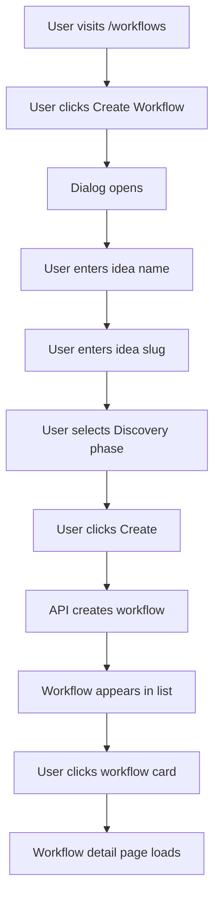
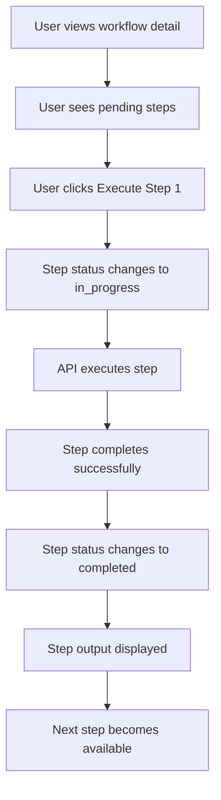
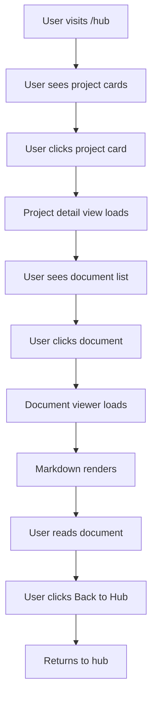
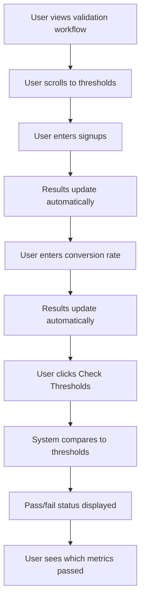

# User Flows: SaaS Starter Hub

## Flow 1: Create Discovery Workflow

### Happy Path

### Emotional Peak
**"I can see my workflow is created and ready to execute"** - When workflow appears in list

### Aha Moment
**"I understand how to execute steps systematically"** - When user sees step-by-step interface

### Story Resolution
**"I've completed discovery and have validated insights"** - When workflow reaches completed state

### Failure Paths

**Path A: Validation Error**
- User submits form with missing fields
- Error message appears in dialog
- User corrects and resubmits

**Path B: API Error**
- Workflow creation fails
- Error message appears
- User can retry or cancel

## Flow 2: Execute Workflow Step

### Happy Path

### Emotional Peak
**"I can see progress happening in real-time"** - When step status updates

### Aha Moment
**"I understand how the workflow system works"** - When first step completes

### Story Resolution
**"I've executed all steps and have results"** - When workflow completes

### Failure Paths

**Path A: Step Execution Error**
- Step execution fails
- Error message appears in step card
- User can retry or skip

**Path B: Network Error**
- API call fails
- Error message appears
- User can retry

## Flow 3: View Project Documents

### Happy Path

### Emotional Peak
**"I can easily find and read my project documentation"** - When document loads

### Aha Moment
**"I understand my project's validation status"** - When viewing validation results

### Story Resolution
**"I have all the information I need to make decisions"** - After reviewing documents

### Failure Paths

**Path A: Document Not Found**
- Document file missing
- 404 page displayed
- User can navigate back

**Path B: Invalid Path**
- Invalid document path
- Error message displayed
- User can try different path

## Flow 4: Track Validation Results

### Happy Path

### Emotional Peak
**"I can see my validation progress clearly"** - When thresholds are checked

### Aha Moment
**"I understand what I need to improve"** - When seeing failed metrics

### Story Resolution
**"I know whether to proceed or pivot"** - After seeing threshold results

### Failure Paths

**Path A: No Results Entered**
- User clicks Check without results
- Error message appears
- User enters results

**Path B: Invalid Input**
- User enters invalid number
- Input validation prevents submission
- User corrects input

